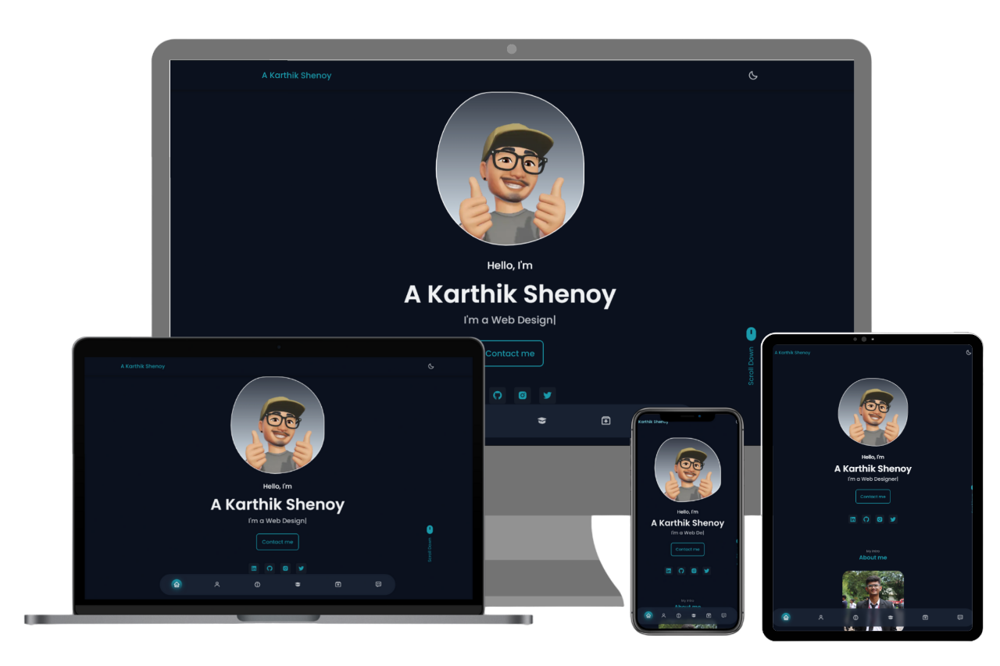

# Personal Portfolio Website

  
    <h2>
      <a href="https://karts13.github.io/">
        karts13.github.io
      </a>
    </h2> 

## Key Highlights

> ⚡️ Fully Responsive\
> ⚡️ Valid HTML5 & CSS3\
> ⚡️ Typing animation\
> ⚡️ Dark / Light Theme\
> ⚡️ Functional Contact Form\
> ⚡️ Cross-Device Compatibility

## Page Sections

> ➥ Home\
> ➥ About\
> ➥ Skills \
> ➥ Qualifications \
> ➥ Projects\
> ➥ Contact Me\
> ➥ Footer
>
> To view a live example, **[click here](https://karts13.github.io/)**

## Tools Used

> - [**GitHub Pages**](https://docs.github.com/en/pages) - To host my static website (HTML, CSS, JS).
> - [**Boxicons**](https://boxicons.com/) - Ready-to-use high-quality SVG icons.
> - [**Scroll Reveal**](https://scrollrevealjs.org/) - Seamlessly revealing content as users scroll
> - [**Tilt.js**](https://gijsroge.github.io/tilt.js/) - JavaScript Library

## Technological Stack
> - HTML5
> - CSS3
> - JavaScript
> - Google Scripts

## Contributions

> If you find any issues or have suggestions for improvement, please open an issue or create a pull request.